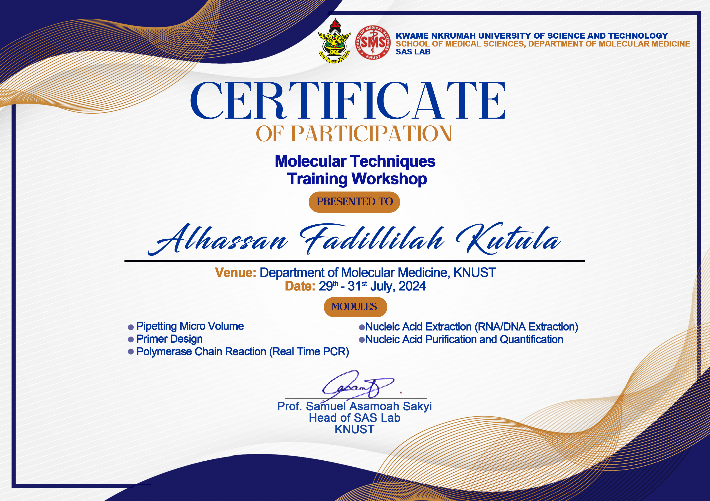

# Data Scientist/Analyst

#### Technical Skills: Python, R, SQL, EXCEL, Power BI

## Work Experience
**MalariaGEN - PAMCA Anopheles Genomics Training Programme**
- Analyzed high-quality real genetic data for surveillance of African malaria vectors, intervention coverage, vector bionomics and insecticide resistance phenotypes
- Developed predictive models linking genetic markers to insecticide resistance keys

**World Quant University - Applied Data Science Lab** 
- Developed and deployed production-grade ML models (regression, time-series, classification, clustering, AB Testing) for real-time applications
- Designed end-to-end predictive systems and adaptive learning systems that evolve with real-time data inputs

**Accenture, Forage**
- Completed a simulation focused on advising a hypothetical social media client as a Data Analyst at Accenture
- Cleaned, modelled and analyzed 7 datasets to uncover insights into content trends to inform strategic decisions
- Prepared a PowerPoint deck and video presentation to communicate key insights for the client and internal stakeholders

## Projects
[### Enhanced Flight Departure Delay Prediction Through Multimodal Machine Learning Integration](https://www.example.com)
- Developed a hybrid predictive model to forecast flight departure delays.
- Web scraped to gather supplementary data that would enhance the model's predictive accuracy. 

### Hypothesis Testing in Healthcare: Drug Safety
- Performed statistical tests to determine whether adverse reactions associated with pharmaceutical drugs were significantly higher than expected.
- Assessed the frequency and significance of adverse reactions associated with the trial drug and placebo
- Conducted exploratory data analysis (EDA) to uncover patterns and distributions in adverse effects.

### Time Series Analysis of Air Quality in Lagos
- Performed SQL Engineering to extact data from Database
- Developed a predictive model to forecast air pollution trends in Lagos

### Segmentation of US Consumer Data
- Employed KMeans Clustering to uncover insights about consumer groups of households in the US

### AB Testing in WQU
- Employed AB Testing to find out whether applicants recieving email had an effect of making them complete Admissions Quiz

## CERTIFICATIONS
### DATA ANALYST - DATACAMP 
[Certified DATA ANALYST](https://www.datacamp.com/certificate/DA0024474928436)

### DATA ANALYST Associate - DATACAMP 
[Certified DATA ANALYST Associate](https://www.datacamp.com/certificate/DAA0018891905289)

### DATA ANALYST Associate - ACCENTURE FORAGE
[Certified DATA ANALYST](https://forage-uploads-prod.s3.amazonaws.com/completion-certificates/T6kdcdKSTfg2aotxT/hzmoNKtzvAzXsEqx8_T6kdcdKSTfg2aotxT_e7v4fXnqogi7NFpgW_1746462587905_completion_certificate.pdf)

### Molecular Lab Technician Expert - SAS LAB, KNUST

## Education
- Bachelors Degree, Computational Biology & Biological Sciences | KNUST

